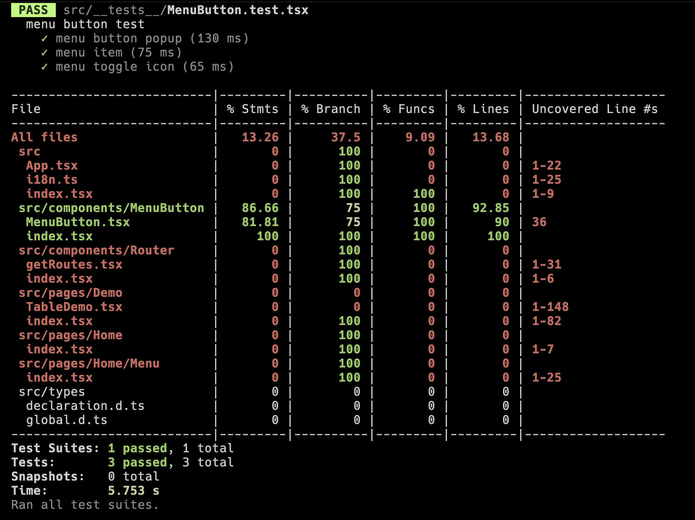

# Txone-demo
A demo page with basic layout and routes(but one page only), to represent the `MenuButton` could be selected no matter the length of menu items or close to border of viewport
This component can be composed with navigation bar, in data table row or even in a popup
modal.

## Flow
1. Starting from `App.tsx`, then route to `Home` page.
2. `Home` consist of `<Menu>` and `<Outlet>`. `<Menu>` could navigate to different routes. But there is only one page `<Demo>` now.
3. The default page `<Demo>` splits into 5 parts representing 5 features.
    - The upper left and bottom right are basic feature, which showing the `MenuButton` could replace the toggle icon easily.
    - The table one showing the `MenuButton` could be selected in the table row.
    - The upper right and the bottom right corner representing it could be selected even close to border of viewport.

## Component: MenuButton
- Using Compound Component to reduce Complexity.
- Open the necessary props only. Even the style is restricted to modify.

## Test report

## Tech stack
- react
- pnpm
- webpack
- eslint
- typescript
- i18n
- react-router
- jest
- playwright
- @tonic-ui/react
- pre-commit
